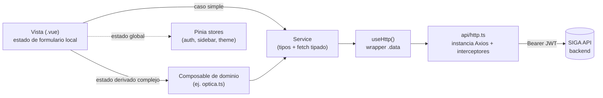

# Arquitectura del Frontend — SIGA-Web

> Escrito 2026-07-08 (Fase 5 del plan de documentación técnica de SIGA, ver `../../SIGA/docs/README.md`). Verificado contra el código real de `src/`, no solo contra `CLAUDE.md` (que tiene secciones desactualizadas — ver nota al final).

## Visión general

SIGA-Web es una SPA en **Vue 3** (Composition API + `<script setup>`), **TypeScript**, empaquetada con **Vite**, que consume la API REST de `SIGA` (backend) vía HTTP/JSON con JWT Bearer. El detalle del contrato de API (endpoints, DTOs, policies) está documentado del lado backend en [`../../SIGA/docs/api-reference.md`](../../SIGA/docs/api-reference.md); este documento cubre solo la arquitectura del cliente.

Stack: Vue 3, TypeScript, Vite (proxy `/api/*` al backend en dev), Vue Router 5, Pinia, Axios, Tailwind CSS v4 con tema por CSS variables (light/dark).

## Estructura de carpetas real

```
src/
├── api/          — http.ts: instancia axios única + interceptores (auth, errores)
├── assets/       — main.css: tokens del tema (colores, tipografía, radios, sombras)
├── components/   — 34 componentes reutilizables (BaseButton, BaseTable, BaseModal, FilterChips,
│                   SearchableSelect, MultiSelect, componentes de dominio como VentaEditor,
│                   TrabajoOpticoCard, ClienteSelector, RecetaSelector, etc.)
├── composables/  — 11 archivos: useHttp (wrapper de axios), useFieldStyles (estilos de campo),
│                   optica.ts (estado derivado del editor de venta óptica), y 8 useXxxPdf
│                   (generación de PDFs client-side: OC, presupuesto, factura de venta, orden de
│                   laboratorio, y 4 reportes — citas/compras/inventario/ventas)
├── config/       — menuConfig.ts: árbol de navegación del sidebar (ver sección Router/Sidebar)
├── router/       — index.ts: único archivo, todas las rutas + guard global
├── services/     — 24 archivos, uno por dominio de negocio (ventasService, inventarioService,
│                   clinicaService, laboratorioService, egresosService, sucursalService, etc.)
├── stores/       — Pinia: auth.ts, sidebar.ts, theme.ts (+ counter.ts, boilerplate sin uso real)
├── utils/
└── views/        — 90 vistas, todas en un único directorio flat (sin subcarpetas por módulo),
                    nombradas por convención `<Modulo><Acción>View.vue` (ej. VentasNuevaView,
                    ProductosView, TrabajosPedidoAprobacionView)
```

## Patrón vista ↔ composable ↔ servicio

No es una cadena rígida de 3 capas — depende de la complejidad de la vista:

- **Caso general (la mayoría de las vistas CRUD):** la vista llama **directo al servicio** correspondiente (ej. `ProductosView.vue` → `inventarioService.getProductos()`). El servicio es un módulo con tipos TS (interfaces que reflejan los DTOs del backend) + funciones delgadas que envuelven `useHttp()` (ej. `services/ventasService.ts`: exporta `EstadoVenta`, `TipoVenta`, `VentaLinea`, `Cobro`, etc. como tipos, y funciones `get/post/put/delete` sobre `/api/ventas`). No hay lógica de negocio en el servicio, solo el contrato HTTP tipado.
- **Estado local de formulario:** vive en la vista misma (`ref`/`reactive` en `<script setup>`), no en un composable ni en un store — patrón confirmado en `CLAUDE.md` § "Patrón de vista CRUD" y consistente con lo observado en el código real.
- **Caso con lógica de estado derivado compleja:** un composable dedicado. El ejemplo real es `composables/optica.ts`, que centraliza el estado del editor de venta/presupuesto óptico (`VentaEditor.vue` + `TrabajoOpticoCard.vue`) — deriva líneas de venta y el bloque `TrabajoPedido` a partir de la selección de armazón/cristal/tratamientos, demasiado complejo para vivir en la vista sola.
- **Generación de PDF:** cada `useXxxPdf.ts` es un composable de un solo propósito (arma el documento a partir del DTO ya cargado), no hace fetch — recibe los datos, no llama a un servicio.
- **`useHttp()`** (`composables/useHttp.ts`) envuelve la instancia central de `api/http.ts` y devuelve `.data` directamente (sin el wrapper de Axios), para que los servicios no repitan `.then(r => r.data)`. **Adopción real, verificada por import (2026-07-09): solo 5 de los 24 servicios lo usan** (`egresosService`, `laboratorioService`, `empleadosService`, `reportesService`, `ventasService`) — los otros 19 importan `http` directo de `@/api/http`. Ambos estilos funcionan porque comparten el mismo interceptor; no hay una regla real de "usar siempre `useHttp`" pese a lo que sugiere `CLAUDE.md` — al tocar un servicio, seguir el estilo del archivo vecino, no una regla única.



## Manejo de estado

**Pinia**, 3 stores con uso real:
- **`auth.ts`** — `token`, `user` (`AuthUser`: email, nombre, permisos, roles, `sucursalId`/`sucursalNombre`, `mustChangePassword`), persistidos en `localStorage` (`siga_token`/`siga_user`) para sobrevivir recargas/pestañas. Expone `hasPermission()`, usado tanto por el guard del router como por la UI para mostrar/ocultar acciones.
- **`sidebar.ts`** — estado de colapso/expansión del sidebar (mobile/desktop).
- **`theme.ts`** — modo claro/oscuro, aplica la clase `.dark` a `<html>`.
- `counter.ts` es el boilerplate por defecto de `create-vue`, sin uso real — candidato a limpieza.

Todo lo demás (datos de listados, estado de modales, formularios) es estado **local de componente**, no global — consistente con que cada vista hace su propio fetch al entrar.

## Router

Un único archivo `router/index.ts` con ~90 rutas planas (no anidadas), cada una con `meta: { requiresAuth?, requiresGuest?, permission?, label? }`. La mayoría de los componentes se cargan con `import()` dinámico (code-splitting por ruta); solo `DashboardView`, `LoginView`, `RegisterView`, `PacientesView`, `PacienteDetailView` y `UsuariosView` se importan estáticos.

**Guard global (`router.beforeEach`)**, en este orden:
1. `requiresAuth` sin sesión → redirige a `/login`.
2. Autenticado con `user.mustChangePassword = true` y no está ya en `/cambiar-contrasena` → fuerza redirección ahí (confirma en código lo que documenta [ADR 0012](../../SIGA/docs/adr/0012-cambio-contrasena-solo-cuentas-nuevas.md): el guard cubre navegación directa y refresh, no solo el login inicial).
3. `requiresGuest` (login/registro) estando ya autenticado → redirige a la primera ruta accesible según permisos (`firstAccessibleRoute`, de `config/menuConfig.ts`).
4. Ruta con `meta.permission` que el usuario no tiene → redirige al primer fallback accesible; si no hay ninguno o el fallback es la misma ruta que falló, deja pasar (evita loop infinito; la vista debe manejar el estado vacío).

La autorización real siempre se revalida en el backend (policies) — este guard es solo UX, no seguridad.

Cobertura de permisos: el backend declara 56 policies (54 simples + 2 compuestas, ver `../../SIGA/docs/architecture.md`), pero el router solo mapea **37 permisos distintos** a `meta.permission` (contado exacto sobre las ~90 rutas, 2026-07-09). El resto se chequea a nivel de acción con `auth.hasPermission(...)` dentro de la vista (botones, ítems de `RowContextMenu`), o directamente no tiene UI todavía.

Dos estrategias de paginación conviven sin unificar: **server-side** en 8 servicios que devuelven `PagedResult<T>` (`clienteService`, `clinicaService`, `comprasService`, `egresosService`, `inventarioService`, `notificacionService`, `patientService`, `ventasService`) y **client-side** en ~18 vistas que hacen slicing local con una constante `PAGE_SIZE` sobre la lista completa ya traída. Antes de armar el footer de una pantalla nueva, verificar cuál usa su servicio — no asumir.

## Sidebar / navegación (`config/menuConfig.ts`)

Árbol de navegación separado del router: cada nodo (`MenuItem`/`MenuChild`, hasta 3 niveles de anidamiento) tiene `permission` propio y opcionalmente `zone` (agrupa secciones bajo un título: *General, Atención, Óptica, Comercial, Gestión*). `AppSidebar.vue` renderiza este árbol filtrando por `auth.hasPermission()` — **no** es una lista fija hardcodeada en el componente (ver nota de desactualización de `CLAUDE.md` abajo). Detalle completo del rediseño (buscador rápido, zonas por permiso real) en memoria de proyecto `siga_sidebar_redesign.md`.

## Responsive (mobile/tablet)

Técnica verificada con Playwright (2026-07-06): sidebar como drawer superpuesto en mobile/tablet (no reflow), controlado por la variable CSS `--sidebar-width` que el layout de `<main>` usa para su `margin-left` — en breakpoints angostos se fuerza a `0` y el sidebar pasa a overlay. Tablas anchas usan scroll horizontal contenido, no reflow de columnas. 8 bugs reales de layout fueron encontrados y corregidos en esa verificación (header, dashboard, gráficos, `VentaEditor`). Detalle completo en memoria de proyecto `siga_responsive.md`.

## Design system

**Fuente de verdad visual: [`../design-system.md`](../design-system.md)** (17KB, 16 secciones: theming/dark mode, tokens de color, radius, sombras, motion, tipografía, layout, `useFieldStyles()`, badges, avatares, componentes base, alertas, page header, paginación, anti-patrones, checklist). `CLAUDE.md` tiene un resumen de las mismas convenciones pero indica explícitamente "ante conflicto, gana `design-system.md`".

Convenciones transversales más citadas en memoria de proyecto (`feedback_siga.md`): `rounded-xl` está **permitido** hoy para modales (la escala de radius fue corregida — `--radius-xl` pasó de `3rem`, el bug viejo, a `20px`); patrón de activar/desactivar entidades **solo** desde menú contextual (`RowContextMenu`), nunca desde el modal de edición; layout de página autenticada con padding `p-8` fijo, sin `max-w-*`.

## Auditoría de vigencia — `CLAUDE.md` y `design-system.md`

- **`design-system.md` — vigente.** Estructura completa y consistente con el código real revisado (tokens, radius, patrones de formulario/tabla/modal). Es la referencia correcta a usar.
- **`CLAUDE.md` — vigente en patrones, desactualizado en inventarios.** Las secciones de *convenciones* (patrón de servicio, patrón de vista CRUD, reglas de diseño, formularios, modales) coinciden con el código real y siguen siendo correctas. Pero:
  - § "Estructura de carpetas" lista solo 2 servicios y 3 vistas de ejemplo — hoy hay 24 servicios y 90 vistas (esperable como "carpeta de ejemplo", pero vale aclararlo si alguien la lee como inventario completo).
  - § "Endpoints backend disponibles" lista ~14 endpoints de una versión muy temprana (solo auth/professionals/patients/roles) — completamente desactualizada frente a los 230 endpoints reales; **reemplazar esa sección por un link a `../../SIGA/docs/api-reference.md`** en vez de mantener una copia que se desincroniza.
  - § "AppSidebar" describe un `navItems` fijo hardcodeado en el componente con items "Dashboard, Pacientes, Agenda..." y badges "soon" — el sidebar real usa `config/menuConfig.ts` con permisos/zonas dinámicas (ver sección de arriba), no un array fijo en el componente. Esta sección necesita reescritura, no solo actualización.
  - No se corrigió nada de esto en esta pasada (fuera de alcance de Fase 5) — queda para una limpieza puntual de `CLAUDE.md`.

## Código muerto conocido

`inventarioService.ts` exporta `getPedidos`, `createPedido`, `updatePedidoEstado` y `cancelPedido`, que pegan a `/api/proveedores/pedidos*` — un endpoint que **no existe** en el backend (verificado 2026-07-09: no hay ninguna ruta `proveedores/pedidos` en `SIGA.Api/Controllers`; el único `pedidos` real es de `LaboratorioController`, un dominio distinto). Ninguna vista importa estas 4 funciones de `inventarioService` — el flujo real de órdenes de compra usa `laboratorioService.getPedidos` (para el circuito de laboratorio) y las vistas de Compras (`PedidosView.vue`, `/compras/oc`) para las OC a proveedor. Son restos de una feature que se movió de lugar; si aparecen en un import nuevo, es un leftover a eliminar, no un patrón a seguir.
